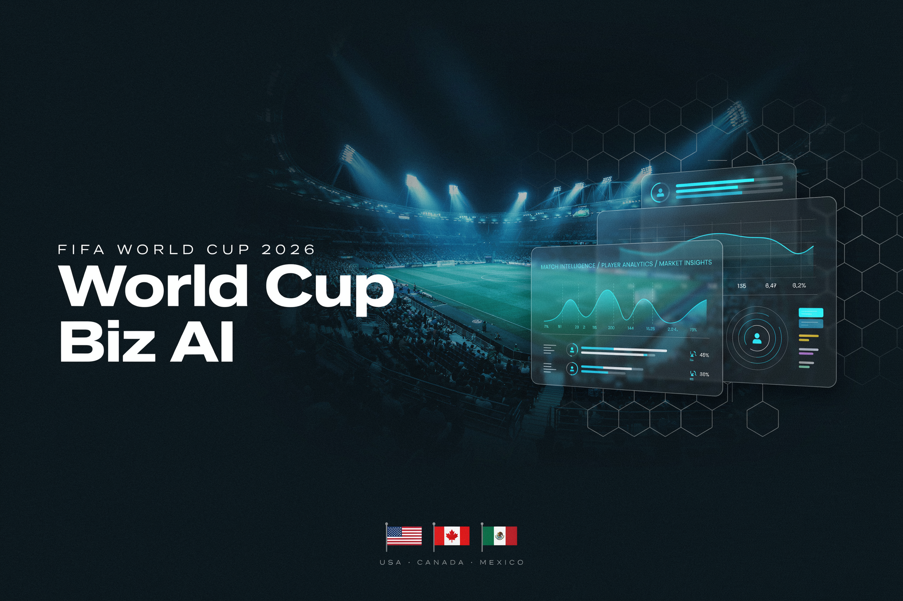

<div align="center">



# ⚽ Match Day Commander

**AI-powered game day operations for local businesses near FIFA World Cup 2026 venues**

  

</div>

<br/>

Local businesses near World Cup venues — restaurants, bars, hotels, retail — have a massive revenue opportunity on match days but no system to act on it. Match Day Commander is a personalized AI agent that ingests match schedules, crowd forecasts, and your business profile to generate targeted campaigns, staffing plans, and inventory recommendations in real time. Enter your details once; the agent tailors everything to you, streamed live as it works.

**Live:** [worldcupbizai.vercel.app](https://worldcupbizai.vercel.app) · Built for the [Google Cloud Rapid Agent Hackathon](https://googlecloudrapidagent.devpost.com/) — MongoDB Partner Track.

## ✨ Features

- **Crowd Intelligence** — match schedules, expected attendance, and fan demographics per venue city pulled from MongoDB Atlas
- **Campaign Generation** — targeted social media posts, email copy, and SMS offers based on the teams playing and expected crowd
- **Operations Planning** — specific staffing levels and inventory boosts calibrated to your capacity and the crowd forecast
- **Real-Time Streaming** — SSE stream surfaces each MongoDB query and tool call as it fires, so you watch the agent think
- **Match Day Notes** — built-in notes sidebar with general and date-specific notes, synced to MongoDB
- **Persistent Memory** — campaigns and recommendations saved to MongoDB Atlas automatically across sessions

## 🎥 Demo

[](https://www.youtube.com/watch?v=9ouM7a25VAI)

## 🛠️ Tech Stack

Gemini 2.5 Flash · MongoDB Atlas · FastAPI · Next.js 16 · Tailwind CSS · shadcn/ui · Google Cloud Run · Server-Sent Events (SSE)

## 🚀 Getting Started

**Backend**

```bash
pip install -r requirements.txt
cp .env.example .env          # add GOOGLE_API_KEY, MONGODB_URI, MONGODB_DB
python -m app.data.seed_data
uvicorn app.main:app --reload --port 8001
```

**Frontend**

```bash
cd frontend
npm install
cp .env.local.example .env.local   # add NEXT_PUBLIC_API_URL=http://localhost:8001
npm run dev
```

**Deploy**

Backend → Google Cloud Run via `gcloud builds submit --config deployment/cloudbuild.yaml`

Frontend → Vercel: `cd frontend && vercel --prod` (set `NEXT_PUBLIC_API_URL` to your Cloud Run URL)

## 📄 License

MIT
